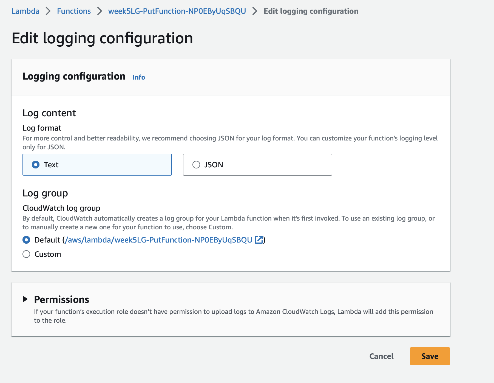
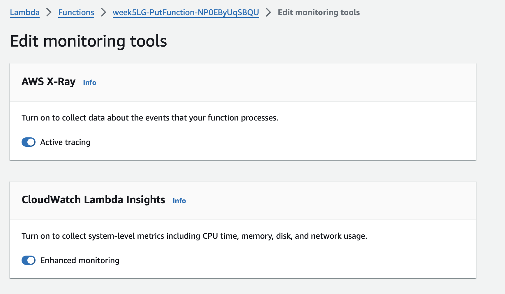
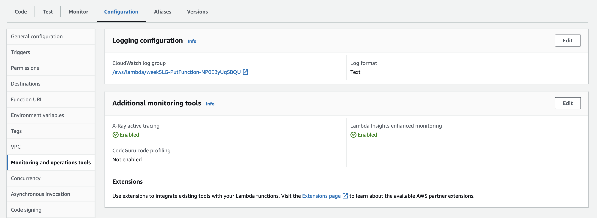
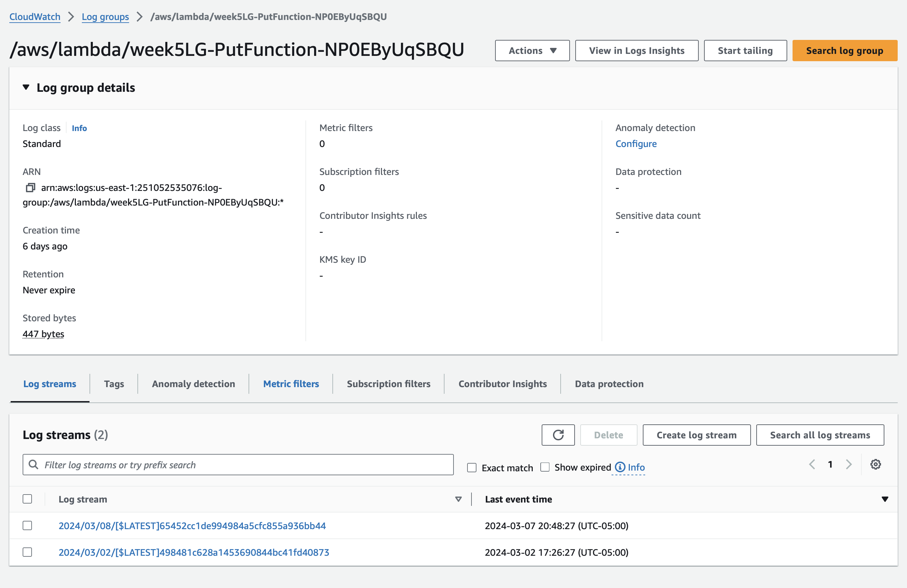
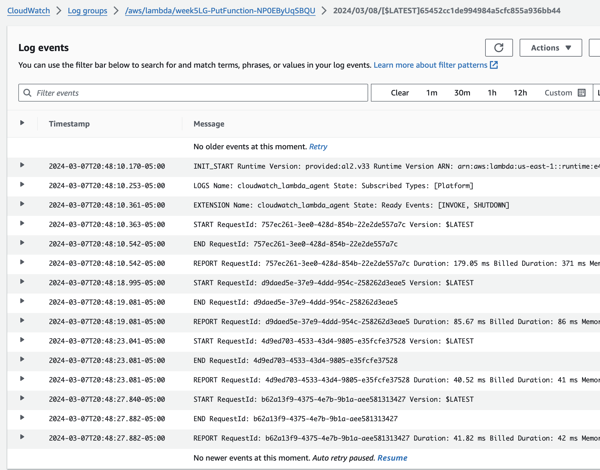
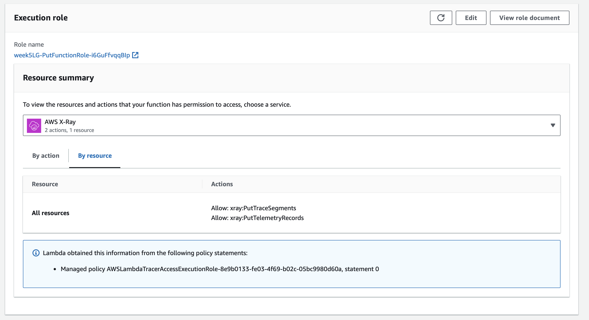
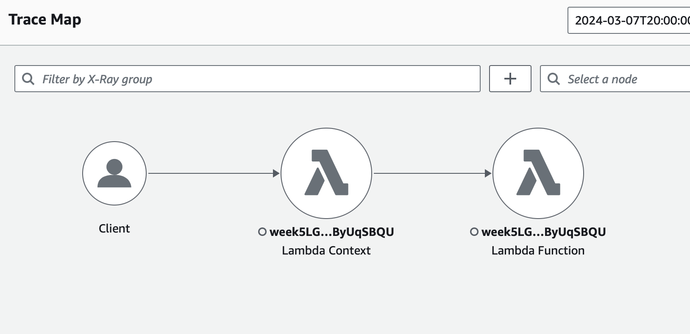
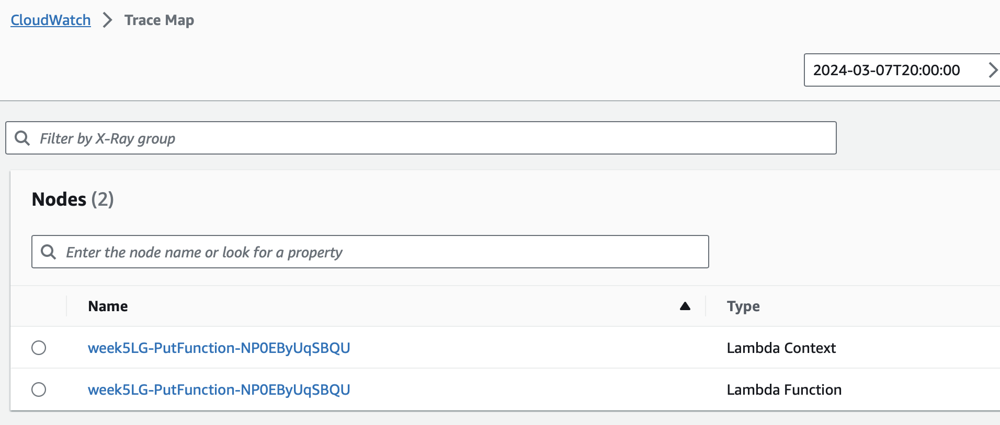
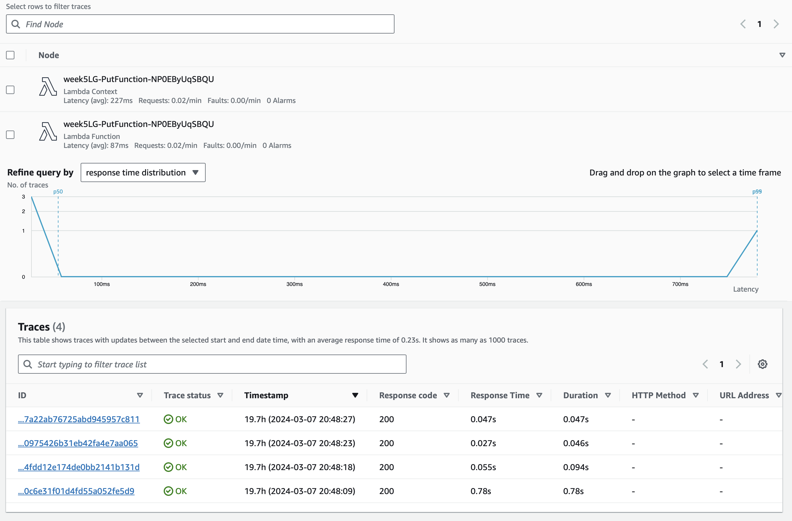
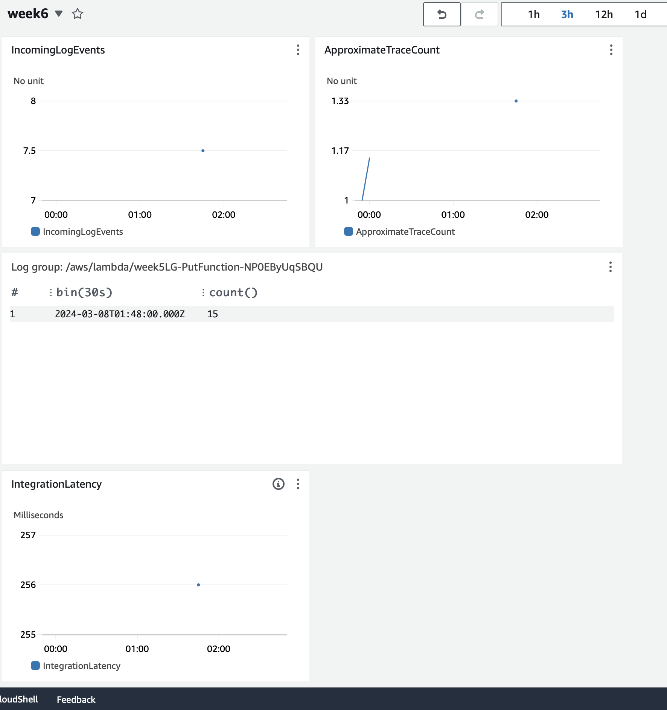

## Week 6: Logging and Monitoring

The intention of this week's mini-project was to add logging and tracing to a lambda function.

To begin this week's project, I began with the application I created in week 5. This application is relatively simple: to add an item to a database, add /{##} to the prod url.

See the following git repository for more information on the creation of the app.

## Configurations
First, I set up configurations on the lambda function.

Navigating to the configuration tab under the lambda function, we can see that the monitoring configurations are set up. 

## Logging

Navigating to cloudwatch -> log groups -> log group of interest, we can see that the logging for this lambda function is set up.   

Selecting the log stream of interest, we can see the logging of the different actions performed.

## Tracing with AWS X-Ray

First, confirm that permissions are set. 

AWS X-Ray produces traces. The following are screenshots from these traces.

## Cloudwatch

After connecting logging and AWS X-Ray to cloudwatch, I was able to produce a dashboard that outlines the logging and monitoring that I set up.

